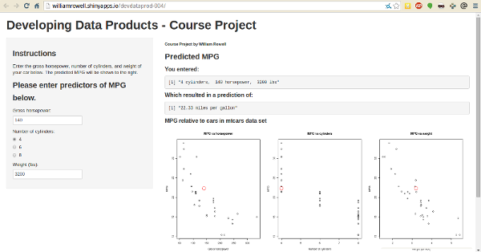

## Fuel Efficiency

Customers are very concscious with fuel efficiency, for various reasons:
- rising cost of fuel
- increasing commute times
- increasing concern for the environment

It's important to be able to predict the fuel efficiency of new cars during the
design stage. Many factors can effect the fuel efficiency, including:
- number of cylinders
- gross horsepower
- weight
- engine displacement
- rear axle ratio
- transmission type

---

## Using the mtcars dataset

The ```mtcars``` dataset can be used to build a model of the effects of car 
characteristics on fuel efficiency.  An example of the data is below:
```{r, results="asis"}
data(mtcars); library(xtable)
print(xtable(mtcars[1:8,]), type = "html")
```

Henderson and Velleman (1981), Building multiple regression models interactively. *Biometrics*, 37, 391–411.

---

## Modelling predictor contribution

Using a linear model, I determined the effect of gross horsepower, number of 
cylinders, and weight on fuel efficiency (mpg), and used this model to create a
function to predict fuel efficiency based on these factors.
```{r}
modelFit <- lm(mpg ~ hp + cyl + wt, data=mtcars)
modelFit$coefficients

mpg <- function(hp, cyl, wt) {
    modelFit$coefficients[1] + modelFit$coefficients[2] * hp + 
        modelFit$coefficients[3] * cyl + modelFit$coefficients[4] * wt
}
```

---

## MPG Prediction Shiny App



The user inputs predictor values in the left sidebar, fuel effiency predictions
are output to the main panel, and plots below the prediction show how the mpg
compares with data from the mtcars dataset.